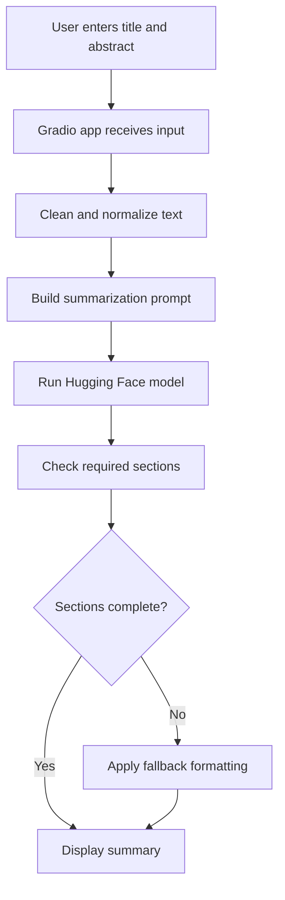

# Scientific Paper Abstract Summarizer

## Subtitle

Beginner-friendly NLP app that converts scientific abstracts into clear plain-English summaries using Hugging Face models.

## Overview

This project helps students, researchers, and non-technical readers understand scientific abstracts more quickly. A user pastes a paper title and abstract into the app, and the system returns a structured summary that explains the main topic, research question, methods, key findings, importance, and important terms in simpler language.

The first version is intentionally small and practical:

- one Hugging Face model
- one clean Gradio interface
- one structured summary format
- easy local setup

## Model Choices Recommendations

### `google/flan-t5-base`
Link: [google/flan-t5-base](https://hf.co/google/flan-t5-base)

- Best starting model for this project
- Good at instruction-following and structured outputs
- Works well for plain-English prompting
- Limitation: not specialized for scientific literature

### `facebook/bart-large-cnn`
Link: [facebook/bart-large-cnn](https://hf.co/facebook/bart-large-cnn)

- Strong summarization baseline
- Easy to use and well documented
- Good comparison model for version 2
- Limitation: trained on news, not scientific abstracts

### `allenai/led-base-16384`
Link: [allenai/led-base-16384](https://hf.co/allenai/led-base-16384)

- Useful for long-document summarization
- Better fit if the project expands from abstracts to full papers
- Limitation: heavier and less beginner-friendly

### `UNIST-Eunchan/Research-Paper-Summarization-Pegasus-x-ArXiv`
Link: [UNIST-Eunchan/Research-Paper-Summarization-Pegasus-x-ArXiv](https://hf.co/UNIST-Eunchan/Research-Paper-Summarization-Pegasus-x-ArXiv)

- More domain-relevant for research-paper summarization
- Good future comparison model
- Limitation: less common and less beginner-friendly than T5 or BART

### `allenai/scibert_scivocab_uncased`
Link: [allenai/scibert_scivocab_uncased](https://hf.co/allenai/scibert_scivocab_uncased)

- Good for scientific language understanding tasks
- Better for future features like jargon detection or entity extraction
- Limitation: not a direct summarization model for version 1

## Architecture

```text
scientific-paper-summarizer/
├── app.py
├── index.py
├── summarizer.py
├── config.py
├── requirements.txt
├── README.md
├── examples/
├── data/
└── tests/
```

- `app.py`: Gradio interface for title, abstract, examples, and output
- `index.py`: FastAPI entrypoint for Vercel-compatible deployment
- `summarizer.py`: Model loading, prompt building, cleaning, and formatting
- `config.py`: Central settings for model choice and generation parameters
- `requirements.txt`: Python dependencies
- `README.md`: Project documentation
- `examples/`: Sample abstracts for testing
- `data/`: Reserved for future datasets or saved outputs
- `tests/`: Basic tests for helper logic and summary structure

## System Design



## How To Run Locally

```bash
git clone https://github.com/JobinJohn24/scientific-paper-summarizer.git
cd scientific-paper-summarizer
python -m venv .venv
source .venv/bin/activate
pip install -r requirements.txt
python app.py
```

On Windows, activate the environment with:

```bash
.venv\Scripts\activate
```

## Example Input And Output

### Example Input

Title:
`Mobile reminder messages and vaccination completion in urban primary-care clinics`

Abstract:
`We conducted a randomized trial across six urban primary-care clinics to test whether SMS reminders improved completion of a two-dose adult vaccination schedule...`

### Example Output

```text
Title: Mobile reminder messages and vaccination completion in urban primary-care clinics

Plain-English Summary: This study tested whether text-message reminders help adults finish a vaccine series. Patients who received reminders were more likely to complete both doses, especially in younger groups. The findings suggest that low-cost messaging can improve follow-up care in busy clinics.

Main Topic: Vaccination adherence and digital health reminders.

Research Question: Can SMS reminders improve completion of a two-dose vaccine schedule?

Methods: The researchers ran a randomized trial in six clinics and compared reminder and no-reminder groups.

Key Findings: Patients who received reminder messages completed the vaccine schedule more often.

Why It Matters: A simple digital intervention may improve public-health outcomes without large costs.

Important Terms Explained:
- SMS: Standard text message sent to a mobile phone.
- Randomized trial: A study where participants are assigned to groups by chance.
```

## Future Improvements

- PDF upload for abstract extraction
- Full paper summarization
- Citation extraction
- Keyword extraction
- Jargon simplification dictionary
- Model comparison dashboard
- Biomedical named entity recognition
- Save summaries as PDF
- Research paper Q&A chatbot
